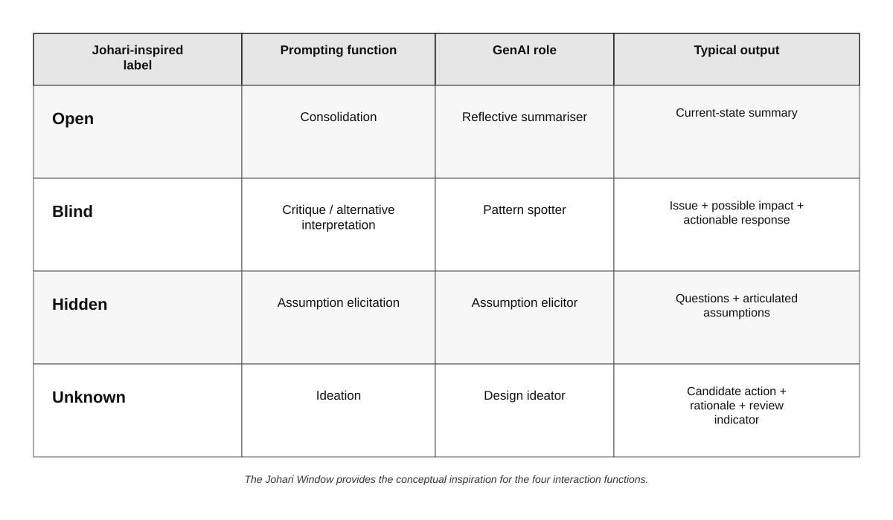
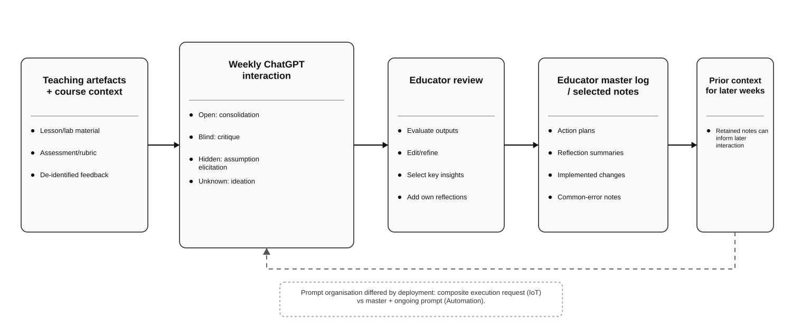

# Reader & Research Companion

**Version 1.0 — paper-aligned reference implementation**

[← Back to main page](../)

This page explains how to use the **Johari-inspired four-function GenAI reflective system** described in the accompanying research paper.

## What the system is

| Label | Function | AI contribution |
|---|---|---|
| **Open** | Consolidation | Summarise the teaching context, evidence, strengths, challenges, and decisions already articulated |
| **Blind** | Critique / alternative interpretation | Identify a plausible omission, misalignment, or alternative interpretation and suggest a practical response |
| **Hidden** | Assumption elicitation | Ask focused questions that help the educator articulate assumptions, constraints, rationales, or heuristics |
| **Unknown** | Ideation | Propose context-sensitive instructional possibilities with a rationale and an observable review indicator |

> **Research boundary:** these labels organise generation. Their presence is not independent evidence of reflective state, reflective quality, or change.

## How to use it

1. Prepare a small, de-identified teaching context.
2. Use the [reference weekly prompt](../../prompts/reference-weekly-prompt.md).
3. Review each output critically.
4. Accept, modify, reject, or defer suggestions.
5. Save educator-selected notes in the [weekly reflection log](../../templates/weekly-reflection-log.md).
6. Bring forward only useful prior context in later sessions.

## Human review

For each AI-generated claim or suggestion, ask:

- What evidence supports this?
- Is it evidence, interpretation, or a suggestion?
- Does it fit my learners, course, resources, and constraints?
- What context is missing?
- What would I observe if I tried the idea?

The educator remains the decision-maker.

## Privacy

- De-identify student-originated material **before upload**.
- Do not upload unnecessary personal or sensitive information.
- Check institutional policy and AI-service data settings.
- Do not use the system for high-stakes individual-student decisions.

## Evaluation boundary

A four-section output shows that the orchestration structure operated.

It does **not** establish improved reflection, deeper self-awareness, pedagogical effectiveness, adoption of an AI suggestion, or movement between Johari states.

If later action is a research outcome, give suggestions persistent IDs and record whether each was **trialled, modified, rejected, deferred, or not evaluable**.

## Resources

- [Reference weekly prompt](../../prompts/reference-weekly-prompt.md)
- [Weekly reflection log](../../templates/weekly-reflection-log.md)
- [Workshop Hub](../workshop/)

## Paper and citation

Add the final paper citation, DOI, and reproducibility link here after publication.
